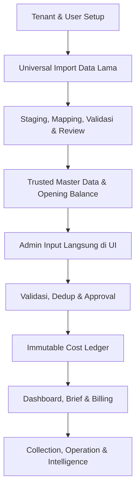

# ADOP — Workflow & Roadmap v1.0

**Produk:** AI Dockyard Operating Platform (ADOP)  
**Tanggal baseline:** 19 Juli 2026  
**Founding Design Partner:** Pak Hanafi  
**Legal entity / nama PT:** Configurable — menunggu konfirmasi  
**Phase aktif:** Phase 1 — AI Cost Control  
**Status dokumen:** Baseline v1.0; dapat diperbarui melalui keputusan LOCK berikutnya

---

## 1. Keputusan Utama

### UI dapat dilanjutkan

Ketidakpastian nama PT dan belum tersedianya template invoice **tidak menghalangi pengembangan UI Phase 1**.

- UI inti memakai identitas produk **ADOP by CHAMELONIX**.
- Nama PT, logo, alamat, kontak, NPWP, rekening, penandatangan, cap, prefix dokumen, dan identitas invoice disimpan sebagai **Tenant & Legal Entity Configuration**.
- Dilarang melakukan hardcode `PT Gamatara` di komponen, database seed produksi, laporan, atau template dokumen.
- Selama nama perusahaan belum final, UI menggunakan label netral seperti **Perusahaan Pak Hanafi**, **Nama Perusahaan**, atau data dummy development yang jelas ditandai.
- Template invoice menjadi dependency untuk finalisasi **Phase 2 — Billing Intelligence**, bukan Phase 1.

### Penyesuaian identitas design partner

Nama **Pak Hanafi** tetap menjadi identitas founding design partner. Nama PT bukan identitas permanen produk dan dapat diganti tanpa mengubah arsitektur, workflow, atau data historis tenant.

---

## 2. LOCK Lintas Semua Phase

Keputusan berikut berlaku untuk seluruh roadmap:

1. **Trust Before Intelligence** — AI hanya bekerja di atas data yang dapat dipercaya.
2. ADOP adalah platform modular, multi-tenant, Excel-friendly, dan API-friendly; **bukan ERP monolitik**.
3. Objek operasional utama adalah **Project Kapal**.
4. Urutan fondasi: authentication → tenant isolation → role permission → trusted master data → immutable ledger → evidence storage → review/approval → audit trail → notification → AI. *(Status: authentication, tenant isolation, role permission, dan trusted master data — Gate 1A: clients/PIC/vessels/vendors/service types/facility locations/expense categories — sudah terimplementasi dengan RLS, immutability guard, dan append-only audit; Project Kapal, immutable cost ledger, dan tahap fondasi berikutnya belum dikerjakan.)*
5. Setiap transaksi finansial penting harus tenant-scoped, dapat diaudit, dan tidak boleh diam-diam ditimpa.
6. Setelah onboarding, workflow operasional utama adalah **admin input langsung di UI ADOP**; Excel bukan aplikasi operasional harian utama.
7. ADOP menyediakan **Universal Data Onboarding & Import** untuk memindahkan data lama agar admin tidak menginput ulang satu per satu.
8. Universal import menerima **Excel/XLSX, CSV, dan PDF** serta menggunakan domain adapter; format satu perusahaan tidak boleh di-hardcode ke core.
9. Import wajib memiliki source-file preservation, staging, mapping, dry-run/preview, duplicate detection, idempotency, reconciliation, audit trail, dan rollback aman.
10. PDF wajib melalui text/table extraction atau OCR, confidence assessment, dan human review; hasil ekstraksi tidak boleh langsung masuk trusted master data atau ledger.
11. Import tidak boleh otomatis memicu alert, workflow, KPI, atau keputusan AI sebelum commit tervalidasi.
12. WhatsApp untuk owner bersifat **read-only copilot** pada Phase 1; data sumber tetap berasal dari ledger tepercaya.
13. Setiap phase wajib selesai melalui checkpoint sebelum phase berikutnya dimulai.

---

## 3. Workflow Utama ADOP v1.0

### Alur Universal Data Onboarding

1. Admin login ke tenant yang benar.
2. Admin memilih domain data yang akan diimpor, lalu mengunggah Excel/XLSX, CSV, atau PDF.
3. Sistem menyimpan file sumber dan hash, kemudian memasukkan hasil parsing/extraction ke staging tenant yang benar.
4. Untuk PDF, sistem melakukan text/table extraction atau OCR serta menampilkan confidence dan sumber halaman.
5. Admin melakukan mapping kolom/field, normalisasi, validasi, dan review kandidat duplikat.
6. Admin melihat dry-run: valid, invalid, duplicate, conflict, total sumber, dan hasil rekonsiliasi.
7. Admin memperbaiki atau mengecualikan baris bermasalah dengan alasan yang tercatat.
8. Hanya batch yang lolos review yang dapat di-commit ke trusted master data, opening balance, atau historical ledger.
9. Sistem menghasilkan import report dan menyediakan rollback batch yang aman.
10. Setelah baseline diverifikasi, tenant diaktifkan untuk operasional langsung melalui UI ADOP.

### Domain Import

| Domain | Phase aktivasi | Contoh data |
|---|---|---|
| Client/customer | Phase 1 | nama, alamat, kontak, identitas perusahaan |
| Kapal | Phase 1 | nama kapal, nomor/identifier, pemilik/client |
| Project Kapal | Phase 1 | project aktif, selesai, service type, facility |
| Vendor/supplier | Phase 1 | vendor material/jasa dan kontak |
| Kategori biaya/master referensi | Phase 1 | expense category, service type, facility location |
| Shared cash/opening balance | Phase 1 | saldo awal dan sumber dana |
| Pengeluaran historis | Phase 1 | transaksi kas lama dan alokasi Project Kapal |
| Dokumen pendukung | Phase 1 | evidence pengeluaran, kontrak, dokumen pendukung transaksi |
| Invoice/billing historis | Phase 2 | invoice, tanggal kirim, due date, dokumen |
| Piutang dan pembayaran | Phase 3 | outstanding, partial/full payment, mutasi |
| Data operasional docking | Phase 4 | jadwal, progress, dan data teknis docking |

Import akun login, role, dan permission tidak boleh langsung mengaktifkan akses. Data personel dapat diimpor sebagai kandidat, tetapi pembuatan akun dan pemberian role tetap melalui workflow keamanan terpisah.

### Alur Kerja Harian Phase 1 Setelah Onboarding

1. Admin login dan memilih tenant/legal entity yang benar.
2. Admin membuka Project Kapal aktif.
3. Admin menginput pengeluaran langsung di UI ADOP dan mengunggah bukti.
4. Sistem memvalidasi field wajib, saldo, tenant, Project Kapal, dan kandidat duplikat.
5. Admin memperbaiki data atau mengirim exception ke human review/approval.
6. Setelah disetujui, transaksi masuk immutable cost ledger dan timeline Project Kapal.
7. Shared daily cash pool, biaya per kapal, saldo, dan exception diperbarui.
8. Owner membaca dashboard, Morning Brief, alert, atau bertanya melalui WhatsApp Copilot read-only.
9. Saat Project Kapal ditutup, sistem menolak input baru dan memeriksa billing; jika belum ada, muncul **Unbilled Vessel Alert**.

---

## 4. Aturan Checkpoint Wajib

Setiap phase hanya boleh dinyatakan **PASS** apabila seluruh gate berikut lulus:

| Gate | Syarat PASS |
|---|---|
| Scope Gate | Seluruh requirement LOCK phase tercakup; item open discovery tidak dikarang |
| Architecture Gate | Tenant isolation, permission, audit, dan domain boundary diverifikasi |
| Data Integrity Gate | Idempotency, reconciliation, duplicate handling, dan rollback diuji sesuai risiko |
| Security Gate | Tidak ada cross-tenant access, secret bocor, atau bypass produksi |
| Test Gate | Unit, integration, dan database test relevan lulus |
| Local Demo Gate | Workflow utama didemokan end-to-end menggunakan data uji lokal |
| Founder UAT Gate | Skenario bisnis dan hasil angka diperiksa; limitation dicatat jujur |
| Documentation Gate | README, PRD, architecture/ADR, workflow, serta open discovery diperbarui |
| Checkpoint Commit | Commit lokal khusus phase dibuat setelah semua gate PASS |
| Release Gate | Push, migration cloud, dan deploy hanya dilakukan setelah izin dan pre-deployment gate PASS |

Checkpoint dapat berstatus:

- **PASS** — seluruh requirement phase terbukti berjalan.
- **PASS WITH LIMITATION** — core aman dan berjalan, tetapi ada limitation eksplisit yang tidak merusak tujuan phase.
- **FAIL / BLOCKED** — ada data, keamanan, workflow, atau requirement penting yang belum terpenuhi.

Urutan kerja standar:

`Implement lokal → Test → Demo lokal → Founder UAT → Checkpoint commit → Pre-deployment gate → Push/migration/deploy`

---

## 5. Roadmap Resmi

### Foundation Gate 0 — Trusted Platform Foundation

**Posisi:** prerequisite teknis, bukan pengganti enam phase resmi.

#### LOCK

- Cloud-ready infrastructure dan environment separation.
- Authentication, tenant isolation, role, dan permission.
- Trusted master data.
- Immutable ledger dan activity/audit trail.
- Approval/review engine.
- Notification engine.
- Secure document/evidence storage.
- API/query layer untuk AI.
- Backup dan recovery.
- Company branding sebagai tenant configuration, bukan hardcode.

#### Checkpoint 0 — Trusted Foundation Gate

PASS jika:

- dua tenant uji tidak dapat membaca atau mengubah data satu sama lain;
- role admin dan owner memiliki akses yang benar;
- mutation penting menghasilkan audit trail;
- konfigurasi nama PT/logo dapat diganti tanpa perubahan kode;
- backup/restore minimum dan environment safety terdokumentasi;
- seluruh test fondasi lulus dan demo lokal berhasil.

**Status sub-gate:**

- Gate 0A (tenant isolation & role model) — **PASS**.
- Gate 0B (tenant-aware local login, active-tenant context, RLS-backed authorization) — **PASS**. Limitation: belum ada UI signup/invitation/role management; hanya login email/password lokal dan pemilihan tenant.

---

### Phase 1 — AI Cost Control / Founding Design Partner Pilot

**Tujuan:** owner mengetahui ke mana uang keluar, untuk kapal mana, siapa yang menginput, apakah terjadi duplikasi, dan berapa posisi kas yang dapat dipercaya.

#### LOCK

- Shared daily cash pool; baseline kebutuhan Pak Hanafi sekitar **Rp50 juta per hari**.
- Project Kapal sebagai pusat biaya dan timeline pekerjaan.
- Expense/cost allocation per Project Kapal.
- Input operasional baru dilakukan langsung melalui UI ADOP.
- Universal Data Onboarding & Import untuk data lama dalam format Excel/XLSX, CSV, dan PDF.
- Domain adapter Phase 1 mencakup client, kapal, Project Kapal, vendor, kategori/master referensi, shared cash/opening balance, dan pengeluaran historis.
- Import memiliki tenant scope, source preservation, staging, preview, mapping, duplicate detection, idempotency, reconciliation, audit, dan rollback.
- PDF menggunakan extraction/OCR, confidence, provenance halaman, dan human review sebelum commit.
- Duplicate transaction detection dan exception review.
- Immutable cost ledger; koreksi melalui reversal/adjustment, bukan overwrite diam-diam.
- Bukti transaksi/dokumen tersimpan aman.
- Project lifecycle dan status aktif/selesai.
- Owner dashboard.
- Morning Brief.
- WhatsApp Copilot untuk owner bersifat read-only.
- Closed Project Kapal tanpa billing memunculkan **Unbilled Vessel Alert**.
- `service_type` dipisahkan dari `facility_location`.
- Service type awal: **Emergency, Standard, Docking, PLTU**.

#### OPEN DISCOVERY

- Daftar final Gate/Dock/Pelabuhan/PLTU atau facility location.
- Jadwal final pengiriman Morning Brief/WhatsApp.
- Struktur approval berdasarkan nominal dan jenis pengeluaran.
- Contoh file Excel, CSV, dan PDF nyata untuk setiap domain dari badan usaha final Pak Hanafi.

#### OUT OF SCOPE PHASE 1

- Full invoice generator.
- Otomasi penagihan piutang.
- Prediksi biaya dan keterlambatan.

#### Checkpoint 1 — AI Cost Control Pilot Gate

PASS jika:

- admin dapat membuat dan menutup Project Kapal;
- admin dapat menginput transaksi operasional langsung melalui UI ADOP;
- file Excel/XLSX, CSV, dan PDF untuk domain Phase 1 dapat melalui staging → mapping/extraction → preview → validasi → commit → reconciliation;
- hasil PDF tidak dapat di-commit tanpa confidence/provenance dan human review;
- import ulang tidak menggandakan transaksi;
- client, kapal, project, vendor, master referensi, opening balance, dan transaksi historis dapat dimigrasikan tanpa input ulang satu per satu;
- duplikasi dan data anomali masuk review, bukan otomatis diterima;
- setiap pengeluaran dapat ditelusuri ke tenant, Project Kapal, actor, waktu, dan bukti;
- saldo shared cash pool serta total per kapal terbukti konsisten;
- dashboard, Morning Brief, dan WhatsApp hanya membaca trusted ledger;
- Unbilled Vessel Alert aktif untuk project closed tanpa billing;
- demo lokal end-to-end, UAT angka, dokumentasi, dan checkpoint commit lulus.

---

### Phase 2 — Billing Intelligence

**Tujuan:** memastikan setiap Project Kapal yang selesai berubah menjadi tagihan yang lengkap, terlacak, dan tidak terlupakan.

#### LOCK

- Workflow baseline: **Project closed → export rekap XLSX → admin menyusun Word → owner tanda tangan/cap basah → upload PDF bertanda tangan → set due date → kirim**.
- Unbilled Vessel Alert menjadi kontrol wajib.
- Invoice terkait langsung dengan Project Kapal, customer/legal entity, nilai tagihan, dokumen final, tanggal kirim, dan due date.
- Audit trail untuk perubahan status billing.
- Phase 2 boleh dimulai dengan workflow hybrid-manual; full generator tidak boleh menunggu jika kontrol billing sudah dapat berjalan aman.

#### Invoice Delivery & Acknowledgement — LOCK

ADOP mengirim invoice melalui WhatsApp dan email, melacak delivery/read signal per kanal, dan meminta explicit customer acknowledgement sebagai bukti penerimaan. Read/open signal tidak pernah otomatis menjadi acknowledgement atau persetujuan tagihan.

- Setiap pengiriman menyimpan: recipient, channel, invoice version, document hash, provider message ID, timestamp, dan append-only delivery event.
- Status per kanal: `queued → sent → delivered → read/open → failed/bounced`.
- Acknowledgement wajib eksplisit melalui tombol/link terverifikasi atau balasan customer — bukan inferensi dari read/open.
- Customer dapat memilih **Ajukan Koreksi/Dispute** sebagai respons terhadap invoice.
- Provider WhatsApp dan email tetap **OPEN/UNCONFIGURED**; tidak ada provider-specific code atau env yang ditambahkan pada scope ini.

#### MENUNGGU INPUT PAK HANAFI

- Contoh invoice nyata.
- Nama PT/legal entity yang menerbitkan invoice.
- Logo, alamat, NPWP, rekening, penandatangan, cap, termin pembayaran, dan prefix nomor invoice.
- Apakah satu tenant memiliki satu atau beberapa legal entity penerbit invoice.

#### STRATEGI TANPA TEMPLATE INVOICE

- **Phase 2A:** bangun billing register, status workflow, upload dokumen, due date, dan alert dengan invoice eksternal/manual.
- **Phase 2B:** setelah template diterima, bangun template/generator invoice tenant-configurable tanpa mengubah domain billing.

#### Checkpoint 2 — Billing Completeness Gate

PASS jika:

- semua project closed memiliki status billing yang eksplisit;
- project closed tanpa invoice terdeteksi;
- invoice manual/PDF dapat diunggah, ditautkan, diberi nomor, tanggal, dan due date;
- tidak ada nomor invoice ganda dalam legal entity yang sama;
- perubahan nilai/status terdokumentasi di audit trail;
- branding dan data legal entity berasal dari konfigurasi tenant;
- bila full generator masuk scope checkpoint, hasil cetak wajib dibandingkan dengan template asli Pak Hanafi;
- local demo, UAT, dokumentasi, dan checkpoint commit lulus.

---

### Phase 3 — AI Cash Collection Intelligence

**Tujuan:** AI mencari dan memantau pembayaran; manusia hanya memverifikasi exception.

#### LOCK

- Invoice tracking dan due-date monitoring.
- Intelligent payment reminder.
- Payment matching melalui bank API atau CSV.
- Partial payment detection.
- Outstanding monitoring.
- Collection risk score.
- Executive Cash Collection Brief.
- Prinsip: **AI mencari pembayaran, manusia hanya memverifikasi**.

#### Reminder by Delivery/Acknowledgement State — LOCK

Reminder Phase 3 menggunakan status delivery/acknowledgement dari Phase 2, bukan asumsi bahwa invoice terkirim berarti diterima:

- Belum delivered, delivered-but-unread, read/open-but-unacknowledged, acknowledged, dan disputed masing-masing menghasilkan tindakan berbeda.
- **Disputed** menghentikan reminder normal dan masuk human review.
- Read/open boleh menjadi risk signal, tetapi bukan bukti persetujuan atau penolakan tagihan.
- Invoice hanya berstatus paid setelah payment matching dan verification — bukan dari acknowledgement saja.

#### OPEN DISCOVERY

- Bank dan metode akses data mutasi.
- Kanal reminder kepada customer.
- Kebijakan reminder, eskalasi, toleransi, dan persetujuan manusia.
- Aturan customer dispute dan write-off.

#### Checkpoint 3 — Cash Collection Integrity Gate

PASS jika:

- outstanding cocok dengan invoice minus seluruh pembayaran terverifikasi;
- full, partial, unmatched, duplicate, dan reversed payment diuji;
- hasil matching memiliki confidence/reason dan dapat direview;
- AI tidak menandai lunas tanpa bukti pembayaran tepercaya;
- reminder mengikuti policy dan memiliki audit trail;
- collection brief cocok dengan ledger serta invoice register;
- local demo, UAT rekonsiliasi, dokumentasi, dan checkpoint commit lulus.

---

### Phase 4 — Dock Operation Intelligence

**Tujuan:** menghubungkan posisi biaya dan billing dengan progres operasional galangan yang nyata.

#### LOCK

- Nama dan urutan phase: **Dock Operation Intelligence**.
- Project Kapal tetap menjadi objek penghubung antara biaya, dokumen, progres, dan kejadian operasional.
- Intelligence tidak boleh berjalan tanpa trusted operational evidence dan audit trail.

#### BELUM LOCK / PERLU DISCOVERY

- Struktur work order dan milestone docking.
- Material usage dan procurement linkage.
- Manpower, vendor, equipment, facility, dan schedule tracking.
- Bukti progres lapangan, approval, delay reason, dan completion evidence.
- Alert keterlambatan atau deviasi operasional.

#### Checkpoint 4 — Dock Operation Evidence Gate

PASS jika:

- scope operasional hasil discovery telah di-LOCK sebelum implementasi;
- setiap milestone/progres memiliki actor, waktu, status, dan evidence;
- hubungan Project Kapal ↔ biaya ↔ aktivitas ↔ dokumen dapat ditelusuri;
- perubahan jadwal/status memiliki reason dan audit trail;
- dashboard tidak mengklaim progres tanpa evidence;
- local demo, UAT operasional, dokumentasi, dan checkpoint commit lulus.

---

### Phase 5 — Executive Intelligence

**Tujuan:** memberi Pak Hanafi satu pandangan owner atas cash, cost, billing, collection, dan operasi.

#### LOCK

- Nama dan urutan phase: **Executive Intelligence**.
- Owner-first intelligence.
- Insight harus berasal dari trusted data lintas phase.
- WhatsApp menjadi kanal ringkasan/alert owner; sistem sumber tetap ADOP.
- Setiap angka atau alert harus dapat ditelusuri ke data pendukung.

#### BELUM LOCK / PERLU DISCOVERY

- KPI final owner.
- Format Daily/Weekly/Monthly Executive Brief.
- Threshold exception dan approval via WhatsApp.
- Struktur portfolio view bila terdapat beberapa legal entity atau galangan.

#### Checkpoint 5 — Executive Trust Gate

PASS jika:

- angka dashboard dan brief cocok dengan ledger sumber;
- setiap insight mempunyai reason, evidence, waktu data, dan drill-down;
- hak akses owner dan legal entity scope benar;
- stale/missing data ditandai, bukan ditafsirkan sebagai kondisi normal;
- alert penting teruji tanpa duplicate spam;
- local demo, owner UAT, dokumentasi, dan checkpoint commit lulus.

---

### Phase 6 — Predictive Intelligence

**Tujuan:** memprediksi risiko sebelum berubah menjadi kerugian, tanpa menghilangkan kendali manusia.

#### LOCK

- Nama dan urutan phase: **Predictive Intelligence**.
- Prediksi hanya dibangun setelah data Phase 1–5 cukup, stabil, dan tepercaya.
- Prediksi bersifat decision support; bukan kebenaran mutlak atau mutation otomatis.
- Human review, confidence, reason, audit, dan model monitoring wajib.

#### BELUM LOCK / KANDIDAT DISCOVERY

- Cost overrun prediction.
- Cash requirement forecast.
- Invoice payment-delay risk.
- Project completion-delay prediction.
- Vendor/material anomaly risk.

#### Checkpoint 6 — Predictive Safety & Value Gate

PASS jika:

- target prediksi dan tindakan bisnisnya telah di-LOCK;
- dataset, label, periode, dan kualitas data terdokumentasi;
- baseline dibandingkan dengan model dan menunjukkan nilai bisnis yang terukur;
- confidence, false positive/negative, drift, dan fallback diuji;
- tidak ada tindakan finansial/operasional otomatis tanpa policy dan approval;
- local shadow-mode demo, founder UAT, dokumentasi, dan checkpoint commit lulus.

---

## 6. UI/UX Design Direction — LOCK

### Referensi resmi

- **Design Spells — “Animation when numbers change in Dub.co”**  
  https://designspells.com/spells/animation-when-numbers-change-in-dub-co

ADOP mengadopsi **prinsip interaksi**, bukan menyalin identitas merek atau keseluruhan tampilan Dub.co.

### Perilaku yang diadopsi

- Angka dashboard tidak berubah mendadak; digit yang berubah bergerak vertikal secara halus seperti rolling counter/odometer.
- Digit yang tidak berubah tetap stabil agar owner mudah menangkap perubahan.
- Perubahan jumlah digit dan lebar angka harus bertransisi mulus.
- Format angka wajib mengikuti konteks Indonesia: `id-ID`, pemisah ribuan, Rupiah, persentase, dan angka negatif.
- Gunakan `tabular-nums` agar posisi angka stabil.
- Animasi harus singkat dan tenang, sekitar 300–500 ms; bukan efek dekoratif berlebihan.
- Nilai naik/turun dapat menggunakan warna semantik ADOP, tetapi warna tidak boleh menjadi satu-satunya penanda.
- Wajib menghormati `prefers-reduced-motion` dan menyediakan fallback tanpa animasi.
- Nilai akhir harus selalu sama dengan trusted data; animasi tidak boleh menunda, membulatkan, atau mengubah makna angka.

### Area penggunaan

- Shared daily cash pool.
- Total cost dan remaining budget per Project Kapal.
- Daily expense dan perubahan saldo.
- Unbilled value.
- Invoice outstanding dan payment collection.
- Executive KPI dan predictive metric pada phase berikutnya.

### Area yang tidak menggunakan animasi

- Input/edit form finansial.
- Audit trail dan tabel rekonsiliasi.
- Invoice, PDF, XLSX, dan dokumen cetak.
- Bukti transaksi dan angka yang sedang dibandingkan saat human review.

### Aturan implementasi

- Sediakan satu komponen reusable, misalnya `AnimatedMetric`/`NumberFlow`, setelah application scaffold dan trusted data layer tersedia.
- Pemilihan library animasi belum LOCK; dependency harus dievaluasi berdasarkan lisensi, aksesibilitas, bundle size, SSR/hydration, dan testability.
- Animasi hanya berjalan ketika trusted value benar-benar berubah, bukan setiap render atau navigasi halaman.
- Komponen wajib memiliki test formatting, nilai negatif, decimal, perubahan digit, reduced motion, dan fallback non-animated.

---

## 7. Urutan Implementasi yang Direkomendasikan Sekarang

1. Bekukan nama PT hanya sebagai **OPEN — Legal Entity TBD**, bukan blocker.
2. Bangun Foundation Gate 0 dan tenant-configurable branding.
3. Bangun trusted domain model Phase 1: client, kapal, Project Kapal, vendor, master referensi, shared cash, dan historical expense.
4. Bangun Universal Data Onboarding untuk Excel/XLSX dan CSV, lalu PDF extraction/OCR, menggunakan domain adapter Phase 1.
5. Verifikasi data baseline client, kapal, project, vendor, master referensi, opening balance, dan pengeluaran historis.
6. Bangun UI operasional Phase 1: Project Kapal, direct expense entry, shared cash pool, expense ledger, review, dashboard, dan evidence.
7. Lakukan Checkpoint 1 sepenuhnya di lokal.
8. Sambil berjalan, minta Pak Hanafi:
   - nama PT/legal entity final;
   - contoh invoice asli;
   - contoh file Excel/XLSX, CSV, dan PDF nyata untuk setiap domain onboarding;
   - struktur approval dan facility location.
9. Setelah Checkpoint 1 PASS, mulai Phase 2A meski template invoice belum tersedia.
10. Aktifkan Phase 2B generator hanya setelah template dan identitas legal diterima.

---

## 8. Keputusan Go / Hold Saat Ini

| Area | Keputusan | Alasan |
|---|---|---|
| Foundation & arsitektur | **GO** | Tidak bergantung pada nama PT atau invoice |
| UI shell & navigation | **GO** | Gunakan ADOP/CHAMELONIX dan tenant configuration |
| Project Kapal & cost ledger | **GO** | Core Phase 1 sudah LOCK |
| Universal import Excel/XLSX, CSV, PDF | **GO** | Onboarding data lama lintas domain sudah LOCK |
| Direct operational input UI | **GO** | Menjadi jalur utama setelah onboarding |
| Owner dashboard & Morning Brief | **GO** | Berdasarkan trusted ledger |
| WhatsApp Copilot read-only | **GO setelah trusted query tersedia** | Tidak boleh membaca data mentah/tidak tervalidasi |
| Billing register & upload PDF | **GO pada Phase 2A** | Dapat bekerja dengan invoice manual |
| Full invoice generator/printing | **HOLD** | Menunggu template invoice dan legal entity final |
| Deploy production | **HOLD sampai checkpoint terkait PASS** | Mengikuti aturan checkpoint dan release gate |

---

## 9. Definition of Done Roadmap v1.0

Roadmap ini dianggap menjadi baseline resmi apabila:

- enam phase mengikuti urutan resmi yang telah LOCK;
- semua keputusan LOCK ditempatkan tanpa mencampur fitur AODP/distributor;
- nama PT diperlakukan sebagai konfigurasi tenant;
- template invoice tidak memblokir Phase 1;
- setiap phase memiliki checkpoint terukur;
- item yang belum diputuskan ditulis sebagai OPEN DISCOVERY atau BELUM LOCK;
- perubahan berikutnya dilakukan sebagai update versi, bukan perubahan diam-diam.